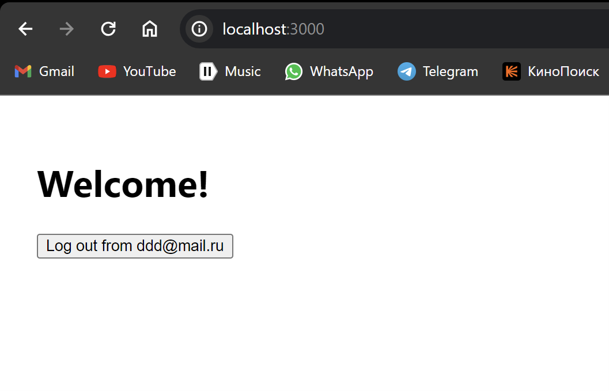
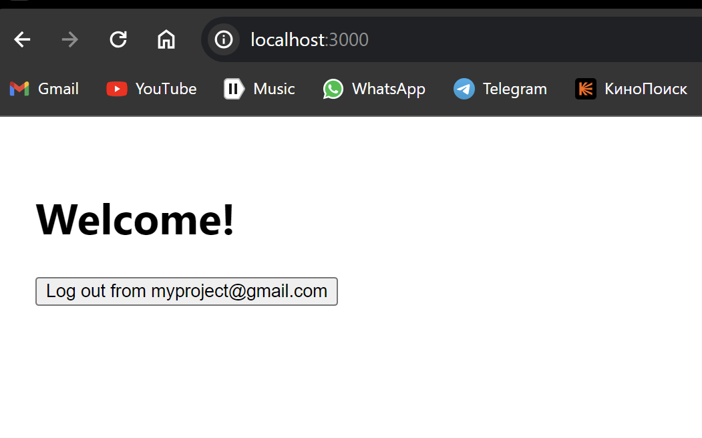
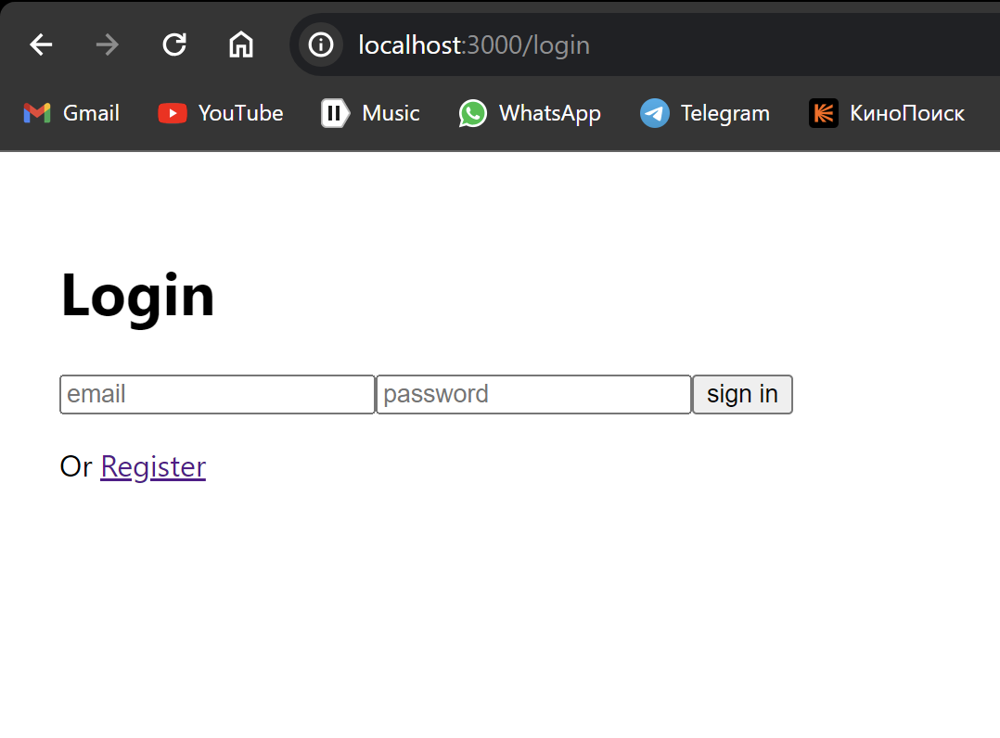
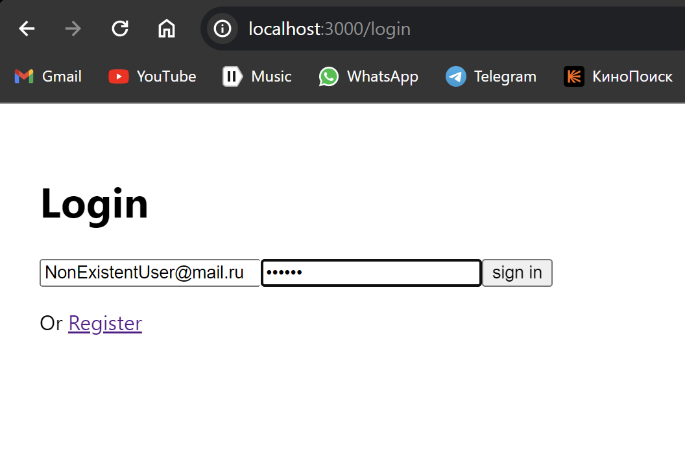
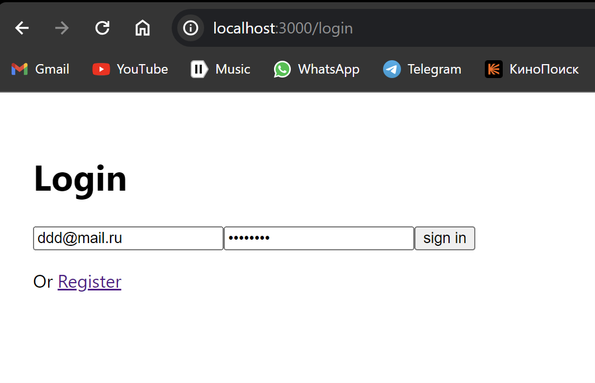
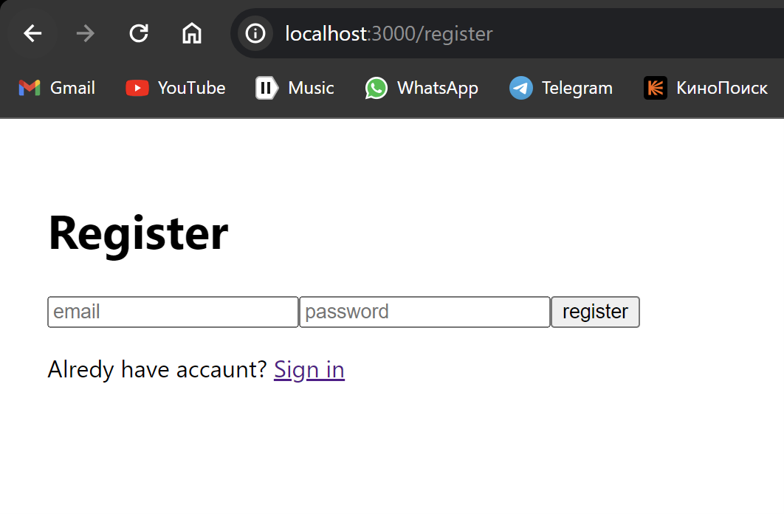
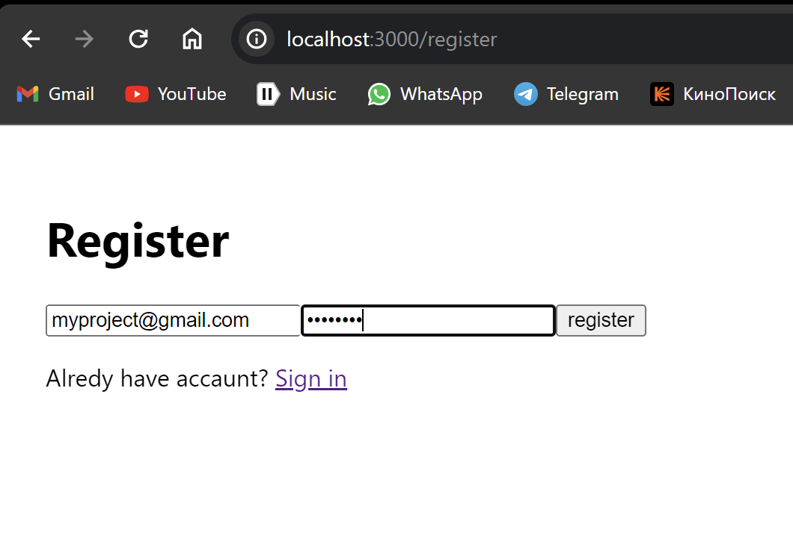

# Authentification (React.js + Firebase)

This project was chosen because I think authorization is a great way to learn React.js, as well as learning how to connect and work with a database.

## What did I do?

### Outline:

- Website home page
- Website login page
- Website register page
- Firebase setting
- Connecting DB with my project

### Home page

This is the page that appears after logging into your account or after registration (the so-called home page).

If you are logged in under the user (for example) ddd@mail.ru, you will see such a page with an option to log out of the account and then redirect to the login page.

And this is how the page will look like if you just registered under a new user (for example) myproject@gamil.com.

### Login Page

This page is required to be filled out, as it takes the user to the home page. If there is no such user, he/she will not be able to access the main page.

It's how this page looks like:

Example with Non-existent user:

User not be able to access the main page.

Another example with exist user:

### Register page

This page is responsible for the registration of new users, after a person fills out all the fields and clicks "register" he will get to the main page.

It's how this page looks like:

And example with filled forms:

### NEW SKILLS:

I now have a better understanding of how React, Redux, Js, Firebase, JSX, Hooks work.

- Working with JSX components
- Creacting my own hook
- Application architecture
- Work with documentation

### References / links:

- [React Docs Eng.](https://react.dev/)

- [React Docs Rus.](https://reactdev.ru/)

- [Firebase Docs Eng.](https://firebase.google.com/docs)

- [Mozilla Docs Eng/Rus](https://developer.mozilla.org/en-US/docs/Web)

## Thank you for your attention

##### P.S: Maybe in the near future I will rewrite this code on TS, and also add styles.
